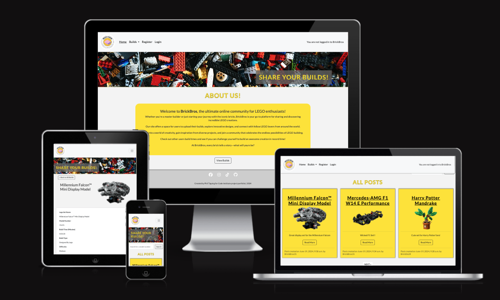

# BRICK BROS | A lego sharing site 

Welcome to BrickBros, the ultimate online community for LEGO enthusiasts!

Whether you're a master builder or just starting your journey with the iconic bricks, BrickBros is your go-to platform for sharing and discovering incredible LEGO creations.

Our site offers a space for users to upload their builds, explore innovative designs, and connect with fellow LEGO lovers from around the world.

Dive into a world of creativity, gain inspiration from diverse projects, and join a community that celebrates the endless possibilities of LEGO building.

Check out other users build times and see if you can challenge yourself to build an awesome creation in record time!

At BrickBros, every brick tells a story—what will yours be?

Using a combination of HTML, CSS, JavaScript and Python (Using the Django FrameWork), the site has been built for lego enthusiasts to post and share their lego creations and builds with an online community. 

The site is responsive and can be used and view on all screen sizes!

## Contents

## User Experience (UX)

### First Time User Goals

### Returning User Goals

### Agile Working

## Website Design

### Wire Frames

### Colour Scheme

### Data Model

## Page Security

### env.py 

### Defensive Programming

### Input Validation

### Toast Messages

## Features

### General

### NavBar

### Home Page

### All Builds

### Search Bar

### Detailed View 

### Add Build

### Login / Logout / Register

### Accessibility 

### Responsive Design (Mobile and Tablet views)

## Technologies and Programmes Used

## Deployment

### Environment and Settings

### Deployment to Heroku

### Local Deployment

#### Forking

#### Cloning

## Additional Content and Credits

### Media/Logos/Images

### Documentation Used

## Acknowlegements

