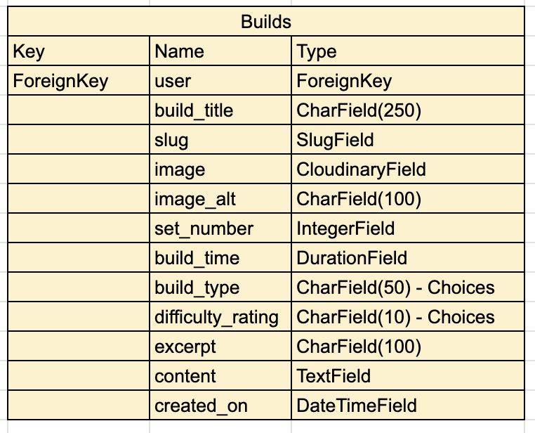

# BRICK BROS | A lego sharing site 

Welcome to BrickBros, the ultimate online community for LEGO enthusiasts!

Whether you're a master builder or just starting your journey with the iconic bricks, BrickBros is your go-to platform for sharing and discovering incredible LEGO creations.

Our site offers a space for users to upload their builds, explore innovative designs, and connect with fellow LEGO lovers from around the world.

Dive into a world of creativity, gain inspiration from diverse projects, and join a community that celebrates the endless possibilities of LEGO building.

Check out other users build times and see if you can challenge yourself to build an awesome creation in record time!

At BrickBros, every brick tells a story—what will yours be?

Using a combination of HTML, CSS, JavaScript and Python (Using the Django FrameWork), the site has been built for lego enthusiasts to post and share their lego creations and builds with an online community. 

The site is responsive and can be used and view on all screen sizes!

## Contents

## User Experience (UX)

Brick Bros is a lego build sharing site. Allowing users full CRUD functionality once registered and logged into a profile. The site allows a user to post their own lego builds and share with the community as well as view other users builds.

### First Time User Goals

- As a first time user I want to be able to understand the purpose of the website as soon as I land on the home page.
- As a first time user I want to be able to look at posted lego builds.
- As a first time user I want to be able to know that I need to register or login to add my own posts.
- As a first time user I want to easily create an account and be notified that I am logged in.
- As a first time user I want to be able to create a post once I am logged in.
- As a first time user I want to be able to edit and delete my own posts once I am logged in.
- As a first time user I want to be notifed of any changes I make:
    - Post has been created
    - Post has been updated/edited
    - Post has been deleted
- As a first time user I want to be able to search for posts via the Model Number search bar.
- As a first time user I want to be able to navigate to the social media pages of the site easily.

### Returning User Goals

- As a returning user I want to know if I am still logged in to my account.
- As a returning user I want to be able to see other users posts the have been added recently (all posts are stored in most recently added order).
- As a returning user I want to be able to view, edit and delete my own posts.

### Agile Working

Before I began coding my project, I set up an Issues template in GitHub and linked it with a board for user stories. In addition, labels and milestones were created ensure my project work was planned accordingly based on the time I had to finish and submit the work.

User stories were added to sprints to allow me to focus on sections of work at a particular time. 

As things occured, other items would be introduced and re-prioritised, enforcing the agile methodology of working. 

## Website Design

### Wire Frames

Wireframes were created using [Balsamiq](https://balsamiq.com/) - This was to allow me a base design to work from when creating the website. 

### Colour Scheme

I used a mono colour scheme with a yellow addition to reference the lego theme.

### Data Model

My data model was drawn up before creating the actual model to serve a template/blueprint before adding it into my models.py file.

## Page Security

### env.py 

### Defensive Programming

### Input Validation

### Toast Messages

## Features

### General

### NavBar

### Home Page

### All Builds

### Search Bar

### Detailed View 

### Add Build

### Login / Logout / Register

### Accessibility 

### Responsive Design (Mobile and Tablet views)

## Technologies and Programmes Used

## Deployment

### Environment and Settings

### Deployment to Heroku

### Local Deployment

#### Forking

#### Cloning

## Additional Content and Credits

### Media/Logos/Images

### Documentation Used

## Acknowlegements

