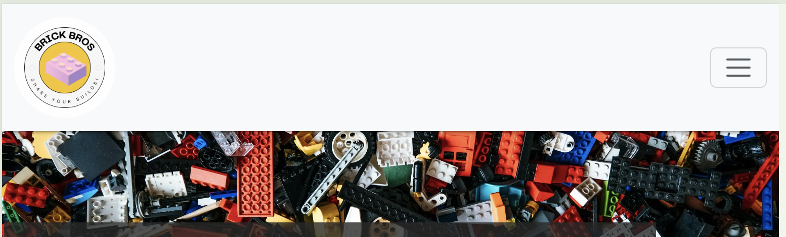

# BRICK BROS | A lego sharing site 

Welcome to BrickBros, the ultimate online community for LEGO enthusiasts!

Whether you're a master builder or just starting your journey with the iconic bricks, BrickBros is your go-to platform for sharing and discovering incredible LEGO creations.

Our site offers a space for users to upload their builds, explore innovative designs, and connect with fellow LEGO lovers from around the world.

Dive into a world of creativity, gain inspiration from diverse projects, and join a community that celebrates the endless possibilities of LEGO building.

Check out other users build times and see if you can challenge yourself to build an awesome creation in record time!

At BrickBros, every brick tells a story—what will yours be?

Using a combination of HTML, CSS, JavaScript and Python (Using the Django FrameWork), the site has been built for lego enthusiasts to post and share their lego creations and builds with an online community. 

The site is responsive and can be used and view on all screen sizes!

## Contents

## User Experience (UX)

Brick Bros is a lego build sharing site. Allowing users full CRUD functionality once registered and logged into a profile. The site allows a user to post their own lego builds and share with the community as well as view other users builds.

### First Time User Goals

- As a first time user I want to be able to understand the purpose of the website as soon as I land on the home page.
- As a first time user I want to be able to look at posted lego builds.
- As a first time user I want to be able to know that I need to register or login to add my own posts.
- As a first time user I want to easily create an account and be notified that I am logged in.
- As a first time user I want to be able to create a post once I am logged in.
- As a first time user I want to be able to edit and delete my own posts once I am logged in.
- As a first time user I want to be notifed of any changes I make:
    - Post has been created
    - Post has been updated/edited
    - Post has been deleted
- As a first time user I want to be able to search for posts via the Model Number search bar.
- As a first time user I want to be able to navigate to the social media pages of the site easily.

### Returning User Goals

- As a returning user I want to know if I am still logged in to my account.
- As a returning user I want to be able to see other users posts the have been added recently (all posts are stored in most recently added order).
- As a returning user I want to be able to view, edit and delete my own posts.

### Agile Working

Before I began coding my project, I set up an Issues template in GitHub and linked it with a board for user stories. In addition, labels and milestones were created ensure my project work was planned accordingly based on the time I had to finish and submit the work.

User stories were added to sprints to allow me to focus on sections of work at a particular time. 

As things occured, other items would be introduced and re-prioritised, enforcing the agile methodology of working. 

## Website Design

### Wire Frames

Wireframes were created using [Balsamiq](https://balsamiq.com/) - This was to allow me a base design to work from when creating the website. 

Using agile methodology some additional pages were added throughout the project which did not have wireframes, however, are just adapated or copied versions of exisiting wireframes.

### Colour Scheme

I used a mono colour scheme with a yellow addition to reference the lego theme.

### Data Model

My data model was drawn up before creating the actual model to serve a template/blueprint before adding it into my models.py file.

## WebPage Security

### env.py 

- Sensitive information is stored in the env.py to allow security of sensitive information on the website. API Keys and Database URL's are stored here in te env.py file which is not included in the version control and deployment to prevent unwanted access and exposure.

### Defensive Programming

- Coding techniques learnt in the course such as the syntax , @login_required and Django packages; LoginRequiredMixin and UserPassesTestMixin are used to restrict access for unauthorised users gaining access to pages/views on the site.
- A 403 page was also added for better UX if a user obtained a URL for a restricted view and was not authorised to perform said action.

### Input Validation

- Django Crispy forms is a useful tool used for adding posts on the website. The built in form allows for validating the form to ensure that fields are correctly filled out with the correct information and not left empty if required. 

### Toast Messages

- Django Messages are used throughout the website to notify the user of any action they peform. This was introduced for a better user experience and understanding of the site. 

- Messages included:
    - Logged in to the site
    - Logged out of the site
    - Added a build post
    - Edited a build post
    - Deleted a build post

## Features

### General

The webpage is responsive to different screen sizes allowing the user to access the webpage on their desired device. Mobile first design was followed throughout. With the use of CSS Media Queries to alter the visual aspect of the page when the screen size is changed.

### NavBar

The nav bar is visible on every page due to being in the base.html file. The BrickBros logo is present as well showing if the user is logged in or logged out of the site.

The navbars state changes based on whether or not a user is logged in or logged out of the webpage. 

- Logged Out

- Logged In

The navbar collapses to a 'hamburger' icon for screensizes 320px - 990px for responsive designing.

- Logged Out

- Logged In

### Home Page

The home page is the landing page for the website. It clearly shows the purpose of the website to the user with a quick access button to view all builds. 

### All Builds

### Search Bar

### Detailed View 

### Add Build

### My Builds

### Messages

### Login / Logout / Register

### Accessibility 

### Responsive Design (Mobile and Tablet views)

## Deployment

### Environment and Settings

### Deployment to Heroku

### Local Deployment

#### Forking

#### Cloning

## Technologies, Programmes, Documentation and Media Used 

### Main Technologies

- HTML
- CSS
- JavaScript
- Django (Python Framework)
- CI Database Maker

### Modules

- cloudinary==1.36.0
- crispy-bootstrap5==0.7
- dj-database-url==0.5.0
- dj3-cloudinary-storage==0.0.6
- Django==5.0.6
- django-allauth==0.63.3
- django-crispy-forms==2.1
- django-resized==1.0.2
- django-summernote==0.8.20.0
- gunicorn==20.1.0
- pillow==10.3.0
- psycopg2==2.9.9
- sqlparse==0.5.0
- whitenoise==5.3.0

### Django Imports 

- LoginRequiredMixin
- UserPassesTestMixin
- SuccessMessageMixin
- Q
- CreateView
- ListView
- DeleteView
- UpdateView
- render
- generic
- messages
- get_object_or_404
- SummernoteModelAdmin
- admin

### External Programmes Used

- [Am I responsive](https://amiresponsive.blogspot.com/?url=https%3A%2F%2F8000-philtipping-pp4brickbro-k1qg35holpj.ws.codeinstitute-ide.net%2F) - For responsive design mockups for the readme documentation.
- [Balsamiq](https://balsamiq.com/) - For creating wireframes of the website.
- [Canva](https://www.canva.com/) - Used to create the BrickBros logo.
- Chrome Dev Tools - Used for testing the project through the entire duration of creation.
- [CI PEP8 Linter](https://pep8ci.herokuapp.com/) - Used to test all python files.
- [Cloudinary](https://cloudinary.com/) - Used for storing images in a cloud based application.
- [Coolors](https://coolors.co/000000-7b7b7a-ffffff-fee607) - For creating a visual representation of the webpage colour scheme.
- [Favicon.io](https://favicon.io/favicon-converter/) - Used to create a Favicon conversion of the logo created in Canva.
- [FontAwesome](https://fontawesome.com/) - For the use of icons throughout the website.
- [Free Convert](https://www.freeconvert.com/image-converter) - Used to convert any images to .webp format.
- Github - Used to store and display all files used in the project.
- GitPod - Cloud Platform IDE used to code and deploy project envirnonment to Github.
- Google Fonts - Used to import into CSS file for use throughout the webpage.
- [Heroku](https://id.heroku.com/login) - Used to host the website
- [Lego Site](https://www.lego.com/en-gb) - Used for images, model numbers and descriptions for all lego posts. 
- Lighthouse - To run tests of peformance on the webpages.
- [Pexels](https://www.pexels.com/photo/close-up-shot-of-bricks-12081662/) - This image was used for the hero banner image on all pages.
- [Table to MD](https://tabletomarkdown.com/convert-spreadsheet-to-markdown/) - Used to convert my manual test spreadsheets to .md format for the Testing.md file.
- [W3C CSS Validator](https://validator.w3.org/) - Used to test all HTML Files
- [W3C Markup Validator](https://jigsaw.w3.org/css-validator/) - Used to test CSS file

### Documentation Used

- [AllAuth](https://docs.allauth.org/en/latest/account/forms.html#reset-password)
- Django docs
    - [Generic Views](https://docs.djangoproject.com/en/4.2/ref/class-based-views/generic-display/)
    - [Class Based Views](https://docs.djangoproject.com/en/5.0/topics/class-based-views/)
    - [Generic editing views](https://docs.djangoproject.com/en/5.0/ref/class-based-views/generic-editing/)
    - [Authentication](https://docs.djangoproject.com/en/5.0/topics/auth/default/)
    - [Making Queries](https://docs.djangoproject.com/en/5.0/topics/db/queries/)

- Codu
    - [Unauthorized Access](https://www.codu.co/articles/securing-django-views-from-unauthorized-access-npyb3to_)

- Geeks for Geeks
    - [DurationField](https://www.geeksforgeeks.org/durationfield-django-models/)

## Credits and Acknowledgements

Thank you to [Lego Site](https://www.lego.com/en-gb) for the use of images, model numbers and descriptions for all lego posts. I do not own any of the content displayed on this webpage.

The Code Institute walkthrough project to give me a base understanding on create a full CRUD project.

