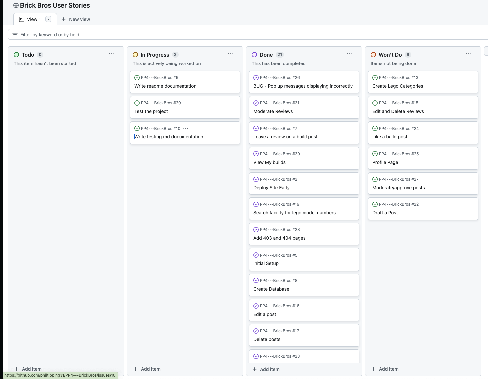
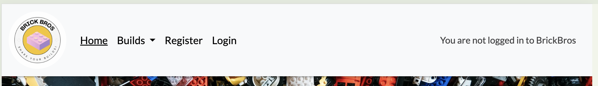
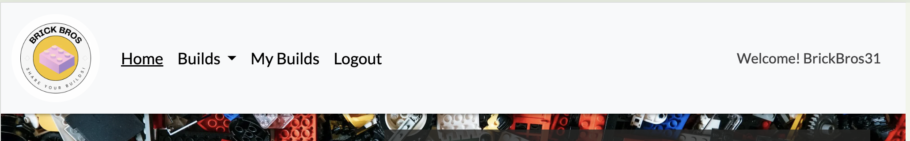
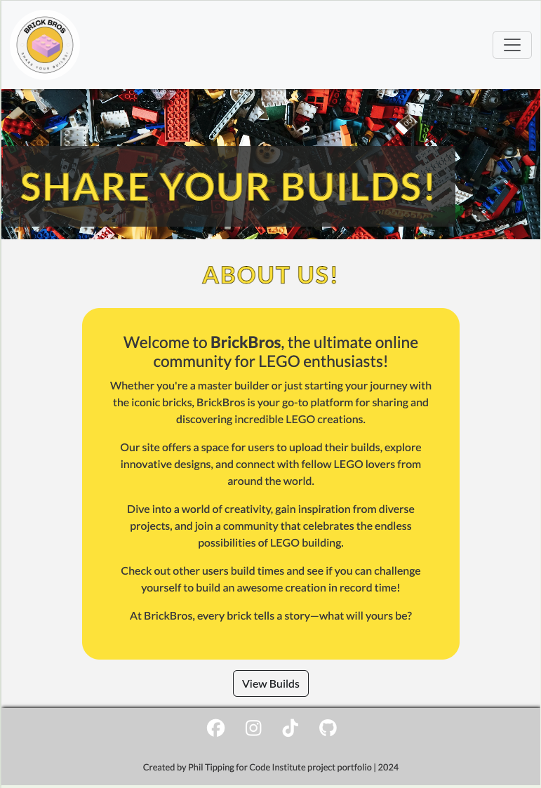
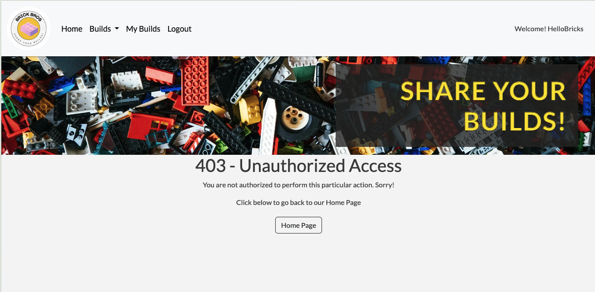

# BRICK BROS | A lego sharing site 

Welcome to BrickBros, the ultimate online community for LEGO enthusiasts!

Whether you're a master builder or just starting your journey with the iconic bricks, BrickBros is your go-to platform for sharing and discovering incredible LEGO creations.

Our site offers a space for users to upload their builds, explore innovative designs, and connect with fellow LEGO lovers from around the world.

Dive into a world of creativity, gain inspiration from diverse projects, and join a community that celebrates the endless possibilities of LEGO building.

Check out other users build times and see if you can challenge yourself to build an awesome creation in record time!

At BrickBros, every brick tells a story—what will yours be?

Using a combination of HTML, CSS, JavaScript and Python (Using the Django FrameWork), the site has been built for lego enthusiasts to post and share their lego creations and builds with an online community. 

The site is responsive and can be used and view on all screen sizes!

## Contents

## User Experience (UX)

Brick Bros is a lego build sharing site. Allowing users full CRUD functionality once registered and logged into a profile. The site allows a user to post their own lego builds and share with the community as well as view other users builds.

### First Time User Goals

- As a first time user I want to be able to understand the purpose of the website as soon as I land on the home page.
- As a first time user I want to be able to look at posted lego builds.
- As a first time user I want to be able to know that I need to register or login to add my own posts.
- As a first time user I want to easily create an account and be notified that I am logged in.
- As a first time user I want to be able to create a post once I am logged in.
- As a first time user I want to be able to edit and delete my own posts once I am logged in.
- As a first time user I want to be notified of any changes I make:
    - Post has been created
    - Post has been updated/edited
    - Post has been deleted
- As a first time user I want to be able to search for posts via the Model Number search bar.
- As a first time user I want to be able to navigate to the social media pages of the site easily.

### Returning User Goals

- As a returning user I want to know if I am still logged in to my account.
- As a returning user I want to be able to see other users posts the have been added recently (all posts are stored in most recently added order).
- As a returning user I want to be able to view, edit and delete my own posts.

### Agile Working

Before I began coding my project, I set up an Issues template in GitHub and linked it with a board for user stories. In addition, labels and milestones were created ensure my project work was planned accordingly based on the time I had to finish and submit the work.

User stories were added to sprints to allow me to focus on sections of work at a particular time. 

As things occured, other items would be introduced and re-prioritised, enforcing the agile methodology of working. 

## Website Design

### Wire Frames

Wireframes were created using [Balsamiq](https://balsamiq.com/) - This was to allow me a base design to work from when creating the website. 

Using agile methodology some additional pages were added throughout the project which did not have wire-frames, however, are just adapted or copied versions of existing wire-frames.

### Colour Scheme

I used a mono colour scheme with a yellow addition to reference the lego theme.

### Data Model

My data models were drawn up before creating the actual model to serve a template/blueprint before adding it into my models.py file.

I used [DBeaver](https://dbeaver.io/download/) to give an accurate representation of my ERD's (Entity Relationship Diagram).

## WebPage Security

### env.py 

- Sensitive information is stored in the env.py to allow security of sensitive information on the website. API Keys and Database URL's are stored here in te env.py file which is not included in the version control and deployment to prevent unwanted access and exposure.

### Defensive Programming

- Coding techniques learnt in the course such as the syntax , @login_required and Django packages; LoginRequiredMixin and UserPassesTestMixin are used to restrict access for unauthorised users gaining access to pages/views on the site.
- A 403 page was also added for better UX if a user obtained a URL for a restricted view and was not authorised to perform said action.

### Input Validation

- Django Crispy forms is a useful tool used for adding posts on the website. The built in form allows for validating the form to ensure that fields are correctly filled out with the correct information and not left empty if required. 

### Toast Messages

- Django Messages are used throughout the website to notify the user of any action they perform. This was introduced for a better user experience and understanding of the site. 

- Messages included:

Logged in to the site
Logged out of the site
Added a build post
Edited a build post
Deleted a build post
Added a review

## Features

### General

The webpage is responsive to different screen sizes allowing the user to access the webpage on their desired device. Mobile first design was followed throughout. With the use of CSS Media Queries to alter the visual aspect of the page when the screen size is changed.

### NavBar

The nav bar is visible on every page due to being in the base.html file. The BrickBros logo is present as well showing if the user is logged in or logged out of the site.

The nav-bars state changes based on whether or not a user is logged in or logged out of the webpage. 

- Logged Out

- Logged In

The navbar collapses to a 'hamburger' icon for screen sizes 320px - 990px for responsive designing.

- Logged Out

- Logged In

### Home Page

The home page is the landing page for the website. It clearly shows the purpose of the website to the user with a quick access button to view all builds. 

### All Builds

The 'All Builds' page is the location where all users posts are displayed. They are ordered in most recently created. 

The builds are limited to 3 posts per page so avoid the need of scrolling. 

Each build has a brief overview on the screen to clearly show the user what the post is. If the user wishes to read more, they can click on the 'Read More' button which takes them through to the detailed view. 

### Search Bar

The search bar is visible on the all builds page. This queries the database and looks for model numbers only. 

Users can enter the set number of a build to see if it exists. 

Information will be shown to the user of the search they performed and show the results if applicable. If nothing matches their search criteria of a model number, no results will show and has a quick link to add a build as the first person to post.

### Detailed View 

The detailed view is displayed when a user choose to click the 'Read More' button on an individual post. This opens up a new view with all of the information about the users build post.

### Add Build

The add build page is a front end user form which allows signed in users to add their posts to share with the BrickBros community. 

If a user is not signed in, the 'Add Build' page will ask them to login to post.

If a user does not fill in required criteria, the post form will notify the user of any missing criteria.

Once a user is logged in and filled in all required criteria, they will be notified that the post was successful. 

### Edit Build

If a user is logged into their own profile, they can click on one of their own posts. Either from the 'My Builds' page or locating it from the 'All Builds' screen.

In addition to the detailed view, the owner of the post will be able to Edit the post. (These options do not occur when viewing a post from a different user account).

When the user clicks on edit. The add post form appears with the title 'Edit Post' - All previous fields are populated and will allow text to be removed/added to/updated. 

Once the edit is completed and submitted, the user will be notified that their edited post was successful.

If an unauthenticated used obtains the URL path to edit a post they do not own, the 403 page will be displayed.

### Delete Build

The delete build option works in the exact same way as the edit build feature. 

However, the user will be asked to confirm whether or not they want to proceed with the post deletion when they do click delete. 

### My Builds

My builds is a navbar option for users that are logged in to their profile. 

This page is a copy of the all builds page but only displays the builds for the logged in user.

If the user has not posted anything yet, this information will be shown to the user with a quick link to add their first post.

### Reviews

### Messages

A variety of 'toast' messages are displayed throughout the site to notify a user that the action they performed was successful. 

These messages include:

    - Successful Login
    - Successful Logout
    - Added a Post
    - Edited a Post
    - Deleted a Post

The messages were styled inline with the website colour scheme, overriding bootstraps default styles.

### Login / Logout / Register

The user account pages were styled with css to fit in with the colour scheme used throughout the site. Some minor text changes were implemented, however the bulk of these pages was taken from Django's AllAuth package. 

- Login Page

- Logout Page

- Register Page

### Accessibility 

Using the following elements, I tried to ensure the website was made as accessible as possible by:

- Using semantic HTML.
- Using aria-labels for screen readers.
- Using alt attributes on images where available.
- A responsive design, allowing users to view and visit the site on a variety of devices.
- Using a simple colour scheme, allowing for appropriate contrasts between the text and background.
- Font sizes and styling are easily readable.
- Front end forms provide user feedback when required.
- Toast messages display notifying the user of performed actions.

### 403, 404 and 500 pages

A 403 page was created and tested so that if a user tries to access a URL to delete a post when they do not own it, the 403 page is displayed notifying the user that they are not authorized to perform the action. 

A 404 page was created so that if a user enters an incorrect URL they will be given a 404 page notifying them of this and allow the user to navigate to the home page easily.

A 500 page was created for internal server errors. Showing the user that the issue is with the webpage and not them.

## Features not yet implemented

- User profile, this would consist of the my builds in condensed view, liked builds, edit/update and delete user profile.
- Auto populate the slug field on Add Post to improve user experience. I could only work this out from an Admin point and not a front end user. 
- Front end edit and delete reviews. This can be controlled by the admin site only.
- Draft Posts - This would allow a user to draft a post and save it for later, linking to the user profile section.
- Lego Categories - Have an option on the add build to categorise the build. This would of then filtered into a navbar menu for Categories. Allowing a user to just view posts relating to a particular lego category.

## Deployment

### Environment and Settings

Set Up env.py:

- Open your IDE and create a file named env.py in the main directory if it doesn't already exist.
- Add the DATABASE_URL and SECRET_KEY values to the env.py file.

Configure settings.py:

- Open settings.py and import the env.py file.
- Add the paths for DATABASE_URL and SECRET_KEY.

Install Django:

- Install Django and update requirements.txt.

Create Your Project:

- Initialize your Django project.

Static Files Settings:

- Add settings for static files in settings.py.

Procfile:

- Create a file named Procfile (with a capital P) in the main directory.

Cloudinary Setup:

- For cloud-based image storage, add the CLOUDINARY_URL to env.py.
- Add Cloudinary libraries to INSTALLED_APPS in settings.py.

Allowed Hosts:

- Add your IDE workspace and Heroku to ALLOWED_HOSTS in settings.py.

Database Migrations:

- Run makemigrations and migrate to set up your database. Using python3 manage.py makemigrations and python3 manage.py migrate in the terminal.

Prepare for Deployment:

- Ensure DEBUG is set to False in settings.py before committing and pushing to GitHub.

### Deployment to Heroku

Create a Heroku App:

- Log in or create an account on Heroku.
- Click 'New' and then 'Create New App'.
- Enter a unique name and select a region, then click 'Create App'.

Connect to GitHub:

- In the Heroku dashboard, go to the 'Deploy' tab.
- Choose 'GitHub' as the deployment method, find your repository, and click 'Connect'.

Set Config Vars:

- Go to the 'Settings' tab and click 'Reveal Config Vars'.
- Add the environment variables from env.py (CLOUDINARY_URL, DATABASE_URL, and SECRET_KEY).
- Add DISABLE_COLLECTSTATIC and set it to 1 to disable, or 0 if the app is ready for static file collection.

Deploy:

- In the 'Deploy' tab, select the branch you want to deploy (usually main) and click 'Deploy Branch'.
- Once deployed, click 'View' to see your live site.

### Local Deployment

#### Version Control

BrickBros was created using the cloud IDE GitPod code editor and pushed to github.

The following git commands were used throughout development to push code to the remote repo:

1. git add . - This command was used to add the file(s) to the staging area before they are committed.

2. git commit -m “commit message” - This command was used to commit changes to the local repository queue, ready for the final step.

3. git push - This command was used to push all committed code to the repository on github.

#### Forking

Fork a Repository:

- Log in to GitHub (or create an account).
- Navigate to the repository you want to fork.
- Click the 'Fork' button in the top right corner.

#### Cloning

Clone a Repository:

- Log in to GitHub (or create an account).
- Navigate to the repository you want to clone.
- Click the 'Code' button and choose to clone using HTTPS, SSH, or GitHub CLI. Copy the link provided.
- Open your terminal and navigate to the directory where you want to clone the repository.
- Run git clone <copied-link> and press enter.

## Technologies, Programmes, Documentation and Media Used 

### Main Technologies

- HTML
- CSS
- JavaScript
- Django (Python Framework)
- CI Database Maker

### Modules

- cloudinary==1.36.0 - A python SDK to integrate with the cloud based image hosting site Cloudinary
- crispy-bootstrap5==0.7 - Django application for creating forms with Bootstrap 5
- dj-database-url==0.5. - To configure Django's database settings using a single database URL
- dj3-cloudinary-storage==0.0.6 - A Django storage backend for integrating with Cloudinary
- Django==5.0.6 - The main Django web framework
- django-allauth==0.63.3 - A Django application for handling user authentication, registration, account management, and social authentication
- django-crispy-forms==2.1 - A Django application that provides a way to style Django forms
- django-resized==1.0.2 - A Django application for resizing images before saving them
- django-summernote==0.8.20.0 - A Django application that integrates the Summernote WYSIWYG editor into Django admin and forms, allowing for rich text editing with a user-friendly interface.
- gunicorn==20.1.0 - A python server
- pillow==10.3. - A Python Imaging Library
- psycopg2==2.9.9 - A PostgreSQL database adapter for Python
- sqlparse==0.5.0 - SQL parser for python
- whitenoise==5.3.0 - A Django middleware for serving static files directly from the application, without relying on an external server

### Django Imports 

- LoginRequiredMixin - A mixin provided by Django that restricts access to views to authenticated users only. 
- UserPassesTestMixin - A mixin used to allow access to a view only if the user passes a certain test.
- SuccessMessageMixin - A mixin that adds a success message to be displayed after a form is successfully submitted.
- Q - A class provided by Django that allows for particular query lookups
- CreateView - A generic view in Django used to handle the creation of new objects.
- ListView - A generic view in Django used to display a list of objects.
- DeleteView - A generic view in Django used to handle the deletion of objects.
- UpdateView - A generic view in Django used to handle the updating of existing objects.
- render - A shortcut function provided by Django that renders a template with a given context and returns an HttpResponse object.
- generic - A module in Django that contains generic class-based views
- messages - A framework in Django for storing and displaying temporary messages to users.
- get_object_or_404 - A shortcut function in Django that retrieves an object from the database based on the provided query parameters. If the object does not exist, it raises a Http404 exception, resulting in a 404 Not Found error page.
- SummernoteModelAdmin - A class provided by the django-summernote package that integrates the Summernote editor with the Django admin interface.
- admin - The Django admin site
- MaxValueValidator and MinValueValidator - Validators provided by Django to enforce maximum and minimum value constraints on fields. 

### External Programmes Used

- [Am I responsive](https://amiresponsive.blogspot.com/?url=https%3A%2F%2F8000-philtipping-pp4brickbro-k1qg35holpj.ws.codeinstitute-ide.net%2F) - For responsive design mockups for the readme documentation.
- [Balsamiq](https://balsamiq.com/) - For creating wire frames of the website.
- [Canva](https://www.canva.com/) - Used to create the BrickBros logo.
- Chrome Dev Tools - Used for testing the project through the entire duration of creation.
- [CI PEP8 Linter](https://pep8ci.herokuapp.com/) - Used to test all python files.
- [Cloudinary](https://cloudinary.com/) - Used for storing images in a cloud based application.
- [Coolors](https://coolors.co/000000-7b7b7a-ffffff-fee607) - For creating a visual representation of the webpage colour scheme.
- [Favicon.io](https://favicon.io/favicon-converter/) - Used to create a Favicon conversion of the logo created in Canva.
- [FontAwesome](https://fontawesome.com/) - For the use of icons throughout the website.
- [Free Convert](https://www.freeconvert.com/image-converter) - Used to convert any images to .webp format.
- Github - Used to store and display all files used in the project.
- GitPod - Cloud Platform IDE used to code and deploy project environment to Github.
- Google Fonts - Used to import into CSS file for use throughout the webpage.
- [Heroku](https://id.heroku.com/login) - Used to host the website
- [Lego Site](https://www.lego.com/en-gb) - Used for images, model numbers and descriptions for all lego posts. 
- Lighthouse - To run tests of performance on the webpages.
- [Pexels](https://www.pexels.com/photo/close-up-shot-of-bricks-12081662/) - This image was used for the hero banner image on all pages.
- [Table to MD](https://tabletomarkdown.com/convert-spreadsheet-to-markdown/) - Used to convert my manual test spreadsheets to .md format for the Testing.md file.
- [W3C CSS Validator](https://validator.w3.org/) - Used to test all HTML Files
- [W3C Markup Validator](https://jigsaw.w3.org/css-validator/) - Used to test CSS file

### Documentation Used

- [AllAuth](https://docs.allauth.org/en/latest/account/forms.html#reset-password)
- Django docs
    - [Generic Views](https://docs.djangoproject.com/en/4.2/ref/class-based-views/generic-display/)
    - [Class Based Views](https://docs.djangoproject.com/en/5.0/topics/class-based-views/)
    - [Generic editing views](https://docs.djangoproject.com/en/5.0/ref/class-based-views/generic-editing/)
    - [Authentication](https://docs.djangoproject.com/en/5.0/topics/auth/default/)
    - [Making Queries](https://docs.djangoproject.com/en/5.0/topics/db/queries/)

- Codu
    - [Unauthorized Access](https://www.codu.co/articles/securing-django-views-from-unauthorized-access-npyb3to_)

- Geeks for Geeks
    - [DurationField](https://www.geeksforgeeks.org/durationfield-django-models/)

## Credits and Acknowledgements

Thank you to [Lego Site](https://www.lego.com/en-gb) for the use of images, model numbers and descriptions for all lego posts. I do not own any of the content displayed on this webpage.

The Code Institute walkthrough project to give me a base understanding on create a full CRUD project.

