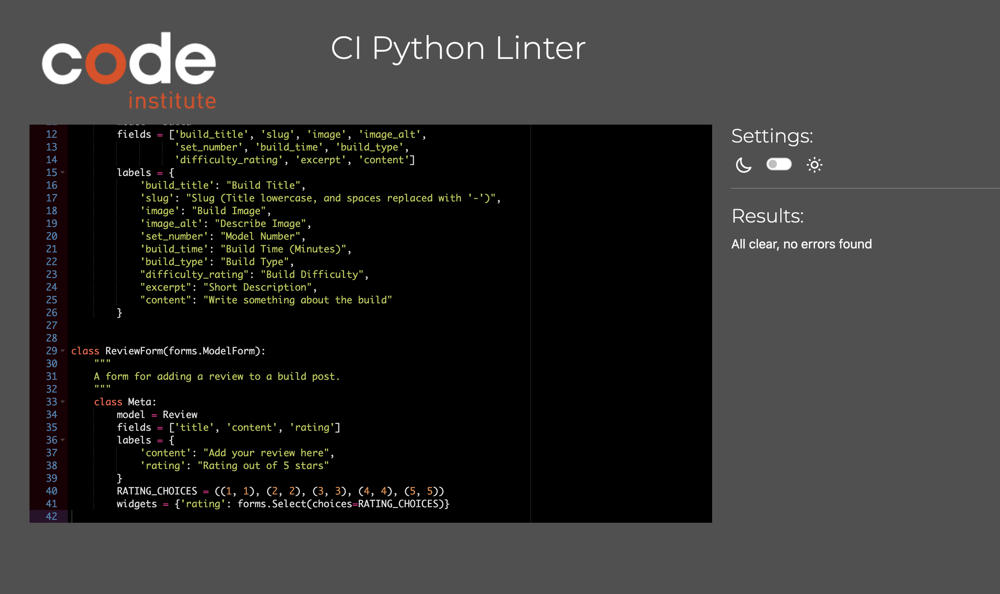
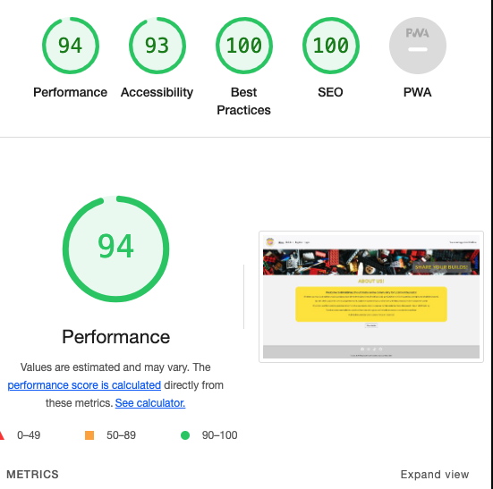
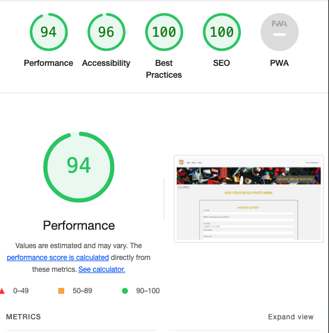
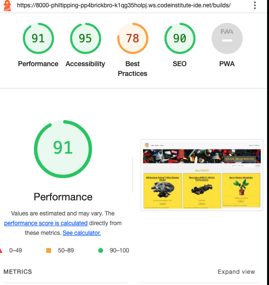
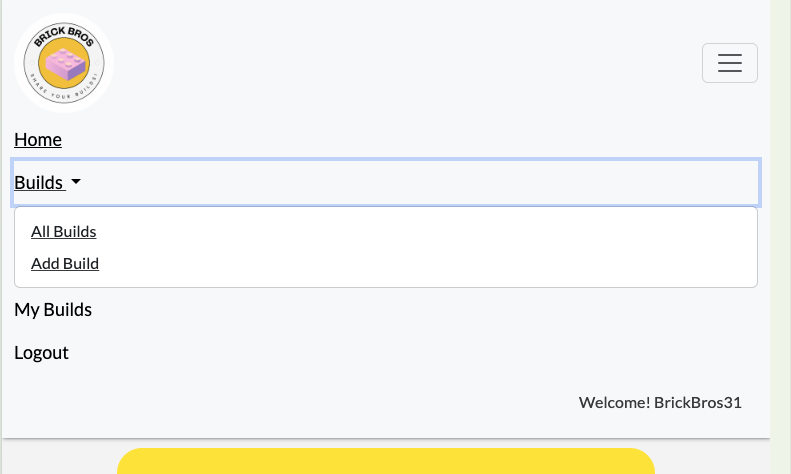

# Documented Manual Testing for | BrickBros

This project was tested throughout the duration of the project creation. This was done with ensuring the user story / feature was designed and working as intended when being coded.
The project was also tested frequently via Google Chrome Dev Tools for display issues. 

## Validation Testing

### HTML Checks

All Html files were tested using [W3C Schools validator](https://validator.w3.org/) in logged in and logged out state.

All issues were resolved and files now pass checks.

### CSS Checks

CCS Files were tested using [W3C Schools CCS Validator](https://jigsaw.w3.org/css-validator/)

File passed checks first time.

### Python Checks

Python files were checked using the [CI PEP8 Linter](https://pep8ci.herokuapp.com/)

Issues were resolved and files now pass checks.

Pep8 was run after each major change was made to any .py file.

#### Outstanding.
I had a few lines too long in the settings.py as shown below:

## User Stories

| User Story                                                                   | Test                                                                                                                             | Action                                                                                                                                                                              | Expected                                                                                                                          | Result (Pass/Fail) |
| ---------------------------------------------------------------------------- | -------------------------------------------------------------------------------------------------------------------------------- | ----------------------------------------------------------------------------------------------------------------------------------------------------------------------------------- | --------------------------------------------------------------------------------------------------------------------------------- | ------------------ |
| [User Story #2](https://github.com/philtipping31/PP4---BrickBros/issues/2)   | The site works as intended throughout in a deployed environment                                                                  | Perform all tests as documented below on the deployed site via Heroku                                                                                                               | All features, views, options work as intended                                                                                     | Pass               |
| [User Story #3](https://github.com/philtipping31/PP4---BrickBros/issues/3)   | Check nav bar and footer are on all pages from base.html                                                                         | View each page in deployed environment and clearly see the navbar and footer                                                                                                       | Features appear on all pages as stem from the base.html file                                                                      | Pass               |
| [User Story #6](https://github.com/philtipping31/PP4---BrickBros/issues/6)   | When logged in and logged out, click 'view more' on a build post to see more content about a specific post                       | Click 'Read More' on a build post when logged in and logged out of a profile                                                                                                        | An individual build post opens up and displays as intended                                                                        | Pass               |
| [User Story #11](https://github.com/philtipping31/PP4---BrickBros/issues/11) | Register button clearly shown in nav bar for users not logged in to an account                                                   | View all pages and check for Register link if not logged in                                                                                                                         | Register field appears in on all pages when user not logged in                                                                    | Pass               |
| [User Story #11](https://github.com/philtipping31/PP4---BrickBros/issues/11) | When register is clicked on, the register page is loaded correctly                                                               | View site on all pages and navigate to the Register (SignUp) page                                                                                                                   | Sign up page correctly loads and is visible on all screen sizes                                                                    | Pass               |
| [User Story #11](https://github.com/philtipping31/PP4---BrickBros/issues/11) | Fields work as intended, username is required, email address is not required, password needs to match criteria                   | Attempt to sign up without required fields - check prompt to complete shows. Try password variation that does not meet criteria and check prompt                                    | Prompts show as intended if criteria does not match. If all fields match then sign-up successful and logs user in to their account | Pass               |
| [User Story #12](https://github.com/philtipping31/PP4---BrickBros/issues/12) | User can not add a build when not logged in                                                                                      | Navigate to 'Add Build' when not logged in                                                                                                                                          | Check sign in page loads asking user to sign in to fully engage with the site                                                     | Pass               |
| [User Story #12](https://github.com/philtipping31/PP4---BrickBros/issues/12) | Once logged in 'Add Build' page is now accessible.                                                                               | Navigate to 'Add Build' when logged in to view the front end form to add a post.                                                                                                    | As the user is logged in the page displays as it should with all fields ready for the user to enter                               | Pass               |
| [User Story #12](https://github.com/philtipping31/PP4---BrickBros/issues/12) | Adding a post successfully                                                                                                       | Attempt to fill in the post form, missing items prompts user to fill in if required. If not image added, default placeholder is added, when post is added, user is notified of this | All features work as intended                                                                                                     | Pass               |
| [User Story #14](https://github.com/philtipping31/PP4---BrickBros/issues/14) | Appending /admin to the URL opens up Django Admin panel                                                                          | Add /admin to the URL to ensure admin access is available for the super user                                                                                                        | Admin page is accessed correctly for the super user. If non super user logged in and appends /admin, access denied                | Pass               |
| [User Story #16](https://github.com/philtipping31/PP4---BrickBros/issues/16) | If a user is logged in, they can view their own post and see the edit button                                                     | Log in as a user and view a post that the user has created to see the edit button                                                                                                   | Edit button displays for an owner of a post                                                                                       | Pass               |
| [User Story #16](https://github.com/philtipping31/PP4---BrickBros/issues/16) | If a user isn't logged in or doesn't own a post, edit will not be an option                                                      | View a post by a different user to the logged in user                                                                                                                               | Edit button is not visible                                                                                                        | Pass               |
| [User Story #16](https://github.com/philtipping31/PP4---BrickBros/issues/16) | If a user edits a post, they can see all previous fields to amend                                                                | Click edit and view the post form again with all fields in place                                                                                                                    | As expected, all items are populated and able to be edited                                                                        | Pass               |
| [User Story #16](https://github.com/philtipping31/PP4---BrickBros/issues/16) | If a user edits a post and submits the edit, they are notified of the confirmation of edit                                       | Edit a post and submit the edit - pop up confirms post edited                                                                                                                       | Edit is successful and pop up shown confirming edit                                                                               | Pass               |
| [User Story #17](https://github.com/philtipping31/PP4---BrickBros/issues/17) | If a user is logged in, they can view their own post and see the delete button                                                   | Log in as a user and view a post that the user has created to see the delete button                                                                                                 | Delete button displays for an owner of a post                                                                                     | Pass               |
| [User Story #17](https://github.com/philtipping31/PP4---BrickBros/issues/17) | If a user isn't logged in or doesn't own a post, delete will not be an option                                                    | View a post by a different user to the logged in user                                                                                                                               | Delete button is not visible                                                                                                      | Pass               |
| [User Story #17](https://github.com/philtipping31/PP4---BrickBros/issues/17) | If a user delete a post, they will be prompted to confirm the deletion of a post                                                 | Click on the delete post option                                                                                                                                                     | Clicking delete, opens up the confirm delete page and allows the user to confirm deletion                                         | Pass               |
| [User Story #17](https://github.com/philtipping31/PP4---BrickBros/issues/17) | If a user deletes a post and submits the deletion, they are notified of the confirmation of edit                                 | Confirm the deletion of a post                                                                                                                                                      | User is directed back to all builds, pop up shows that post was successfully deleted                                              | Pass               |
| [User Story #18](https://github.com/philtipping31/PP4---BrickBros/issues/18) | Once user has registered for account they can login                                                                              | Create a user and login                                                                                                                                                             | Login successful                                                                                                                  | Pass               |
| [User Story #19](https://github.com/philtipping31/PP4---BrickBros/issues/19) | Search bar shows on the 'All Builds' page                                                                                        | Go to all builds and search bar is available                                                                                                                                        | Search bar displays on all builds page                                                                                            | Pass               |
| [User Story #19](https://github.com/philtipping31/PP4---BrickBros/issues/19) | Search bar placeholder text shows just model numbers accepted                                                                    | Search bar clearly tells user to search for model numbers                                                                                                                           | Model number search feature works                                                                                                 | Pass               |
| [User Story #19](https://github.com/philtipping31/PP4---BrickBros/issues/19) | When a search is made, results show if match found                                                                               | Type in a model number that exists in the database                                                                                                                                  | Search clearly displays the correct results                                                                                       | Pass               |
| [User Story #19](https://github.com/philtipping31/PP4---BrickBros/issues/19) | When a search is made and no matches found, user is notified of this                                                             | Enter a model number that does not exist                                                                                                                                            | Page shows no matches found and prompts user to add the first post                                                                | Pass               |
| [User Story #20](https://github.com/philtipping31/PP4---BrickBros/issues/20) | If a user is logged in they can see the option to logout in the navbar                                                           | Once logged in, checked that the logout button/link is available                                                                                                                    | Once logged in, the logout button/link is available                                                                               | Pass               |
| [User Story #20](https://github.com/philtipping31/PP4---BrickBros/issues/20) | If user clicks logout, they will be asked if they meant to do this. Also option to go to the home page for UX will be an option  | Click logout and check that the user is asked to confirm the action                                                                                                                 | Logout button takes you to the correct page asking to confirm whether or not you want to login or go back to the home page        | Pass               |
| [User Story #20](https://github.com/philtipping31/PP4---BrickBros/issues/20) | If user confirms logout, user will be logged out and notified                                                                    | Click confirm log out                                                                                                                                                               | User is notified that they have been logged out.                                                                                  | Pass               |
| [User Story #30](https://github.com/philtipping31/PP4---BrickBros/issues/30) | If a user is logged in, they have access to the My Builds link in the navbar                                                     | Login and check nav bar for correct option for My Builds appears                                                                                                                    | Once logged in the My Builds option shows in the nav bar                                                                          | Pass               |
| [User Story #30](https://github.com/philtipping31/PP4---BrickBros/issues/30) | If a user is logged in, clicking on My Builds takes them to a page the same as all builds but filtered with the users posts only | Log in and click on My Builds                                                                                                                                                       | All builds are shown for that particular user                                                                                     | Pass               |
| [User Story #30](https://github.com/philtipping31/PP4---BrickBros/issues/30) | If a user is not logged in, the my builds option in the nav bar does not show                                                    | Remain logged out of the site                                                                                                                                                       | My builds is not an option in the navbar                                                                                          | Pass               |
| [User Story #30](https://github.com/philtipping31/PP4---BrickBros/issues/30) | If a user has the URL for My Builds and is logged out, the login page is loaded                                                  | Logout of the site, and enter the url for mybuilds                                                                                                                                  | Login page is loaded as this a restricted view for not logged in users                                                            | Pass               |
| [User Story #31](https://github.com/philtipping31/PP4---BrickBros/issues/31) | Use Django Admin to view, moderate and approve reviews                                                                           | Login to the admin panel, go to 'Reviews' and see user reviews. Go into an unapproved review and approve it.                                                                        | Admin can easily approve reviews                                                                                                  | Pass               |
| [User Story #31](https://github.com/philtipping31/PP4---BrickBros/issues/31) | Check the approved tick box in admin to see if review then displays on site                                                      | Once a review is approved, check that it correctly displays on site                                                                                                                 | After admin approve a review it shows on site                                                                                     | Pass               |
| [User Story #7](https://github.com/philtipping31/PP4---BrickBros/issues/7)   | Check logged out user is unable to leave a review                                                                                | Remain logged out of the site and go to a builds view. The review form is replaced with asking the user to login                                                                    | Logged out user is unable to leave a review                                                                                       | Pass               |
| [User Story #7](https://github.com/philtipping31/PP4---BrickBros/issues/7)   | Check that a logged in user can add a review                                                                                     | Login to the site and navigate to the detailed view of a build. Scroll down to see the review section and add in a review                                                           | Once review is added, user can see this has been posted                                                                           | Pass               |
| [User Story #7](https://github.com/philtipping31/PP4---BrickBros/issues/7)   | Check that the user is notified once a review is posted                                                                          | After adding a review, check the pop up message displays correctly                                                                                                                  | Message shows as intended                                                                                                         | Pass               |
| [User Story #7](https://github.com/philtipping31/PP4---BrickBros/issues/7)   | Check that the review is not posted initially, awaiting approval from admin. User is notified of this on a post                  | After submitting a review, going back to the post that was reviewed, the user can clearly see a message showing that it is awaiting approval.                                      | Awaiting approval message is shown under the review for the logged in user                                                        | Pass               |
| [User Story #7](https://github.com/philtipping31/PP4---BrickBros/issues/7)   | Check that only approved posts are shown to other users and pending reviews are only visible to the user that posted.            | Logout of the site, and go back to the post where the review was added and awaiting approval. Check that the review is not visible.                                                 | Review is not visible as it is awaiting approval. Reviews awaiting approval are only visible to the user that added them.         | Pass               |

## Manual Testing

### Responsiveness

Site was tested using Chrome Dev Tools with the responsiveness section. Ensuring the webpage can be clearly used on all screen sizes/devices.

### Lighthouse Tests

Lighthouse tests were run in an incognito window. 

Issues found with best practices on all builds page due to Cloudinary Images 

### Navbar 

| Test                                                                                                      | Action                                                                                                                                         | Expected                                                                                                                                                                       | Result (Pass/Fail) |
| --------------------------------------------------------------------------------------------------------- | ---------------------------------------------------------------------------------------------------------------------------------------------- | ------------------------------------------------------------------------------------------------------------------------------------------------------------------------------ | ------------------ |
| Nav Bar shows Home / Builds drop down > All Builds / Add Build and Register / Login for a first time user | Visit the site as a logged out user and check correct nav items are showing and navigate to the correct page                                   | Nav items correctly display and open the correct page                                                                                                                          | Pass               |
| Nav Bar Shows Same options, but Login changes to Logout when user is logged in                            | Login to the website and check the nav bar has removed login and register and now shows all items as normal but the logout link is an option   | Nav items correctly display and open the correct page                                                                                                                          | Pass               |
| Nav Bar items direct the user to the correct location                                                     | Test all navbar links by clicking on them and checking the correct page loads                                                                  | All nav items are directing the user to the correct location                                                                                                                   | Pass               |
| Nav bar works in tablet/mobile view                                                                       | Use chrome dev tools on responsive mode and also open webpage on a mobile device to check full functionality of the the nav bar view and links | All nav items are hidden in a closed button, clicking on this opens the nav menu and all items are shown based on the current state and open up the correct page when selected | Pass               |

### Footer 

| Test                                                       | Action                                                                                       | Expected                                                          | Result (Pass/Fail) |
| ---------------------------------------------------------- | -------------------------------------------------------------------------------------------- | ----------------------------------------------------------------- | ------------------ |
| All footer links open in a new tab to the correct location | Click on each footer social and check that the correct social page is opened up in a new tab | All links direct to the correct location and in a new browser tab | Pass               |

### Pagination

| Test                                                                                          | Action                                                    | Expected                                                                                                             | Result (Pass/Fail) |
| --------------------------------------------------------------------------------------------- | --------------------------------------------------------- | -------------------------------------------------------------------------------------------------------------------- | ------------------ |
| Pagination works correctly as per code of 3 per page                                          | Each builds page clearly shows 3 builds posts             | 3 Builds posts show on each page                                                                                     | Pass               |
| If more than 3, next button shows                                                             | Add more than three builds to see the next button appear. | The next button shows and clearly moves the user to see the next set of builds over 3                                | Pass               |
| if more than 9 the middle set of three allows the user to see previous button and next button | Add more builds so posts extend over multiple pages.      | Next and Prev button clearly show and operate as intended, taking the user from page to page to see all builds posts | Pass               |

### 403, 404 and 500 pages

| Test                                             | Action                                                                                                                     | Expected                                                                                                 | Result (Pass/Fail) |
| ------------------------------------------------ | -------------------------------------------------------------------------------------------------------------------------- | -------------------------------------------------------------------------------------------------------- | ------------------ |
| Check that the 403 page shows when intended      | In deployed environment logout of a profile and copy the URL to delete/edit a post                                         | 403 page displays as the user is not authenticated to perform this action                                | Pass               |
| Check that the 404 page shows when intended      | In deployed environment, append characters onto the URL and attempt to go to an incorrect URL                              | 404 page displays to the user as the URL they entered does not exist                                    | Pass               |
| Check that the 500 page shows when intended      | In deployed environment, remove a config var for cloudinary, load the page up and go to 'All builds'                       | 500 page correctly displays as there is an internal server error which can't display the page correctly. | Pass               |
| Check the back to home button works on all pages | On each test for each page, click on the back to home button to ensure the user is taken back to the home page of the site | Back to home button takes the user back to the main home page of the site successfully                   | Pass               |

### Outstanding issues

On Mobile/Tablet view, the nav bar drop down for Builds, incorrectly underlines both 'All Builds' and 'Add Build' - the underline class is assigned to Active links only, so should not be underlined in the current state. (On home page, wanting to navigate to the builds section)

