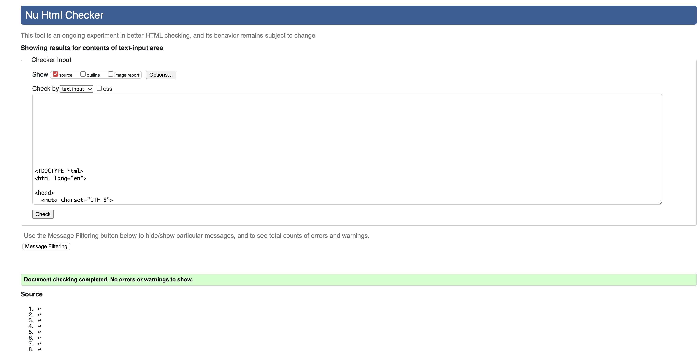
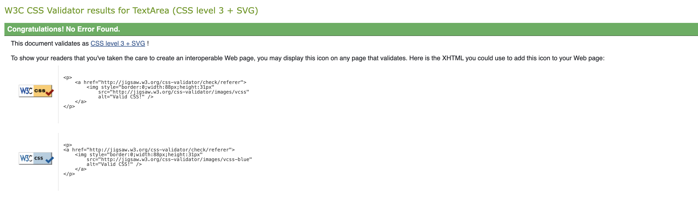
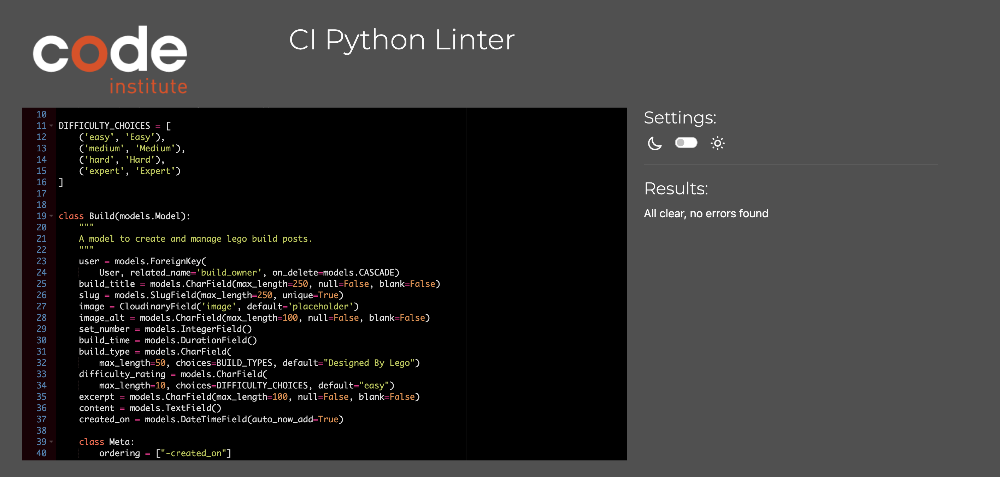
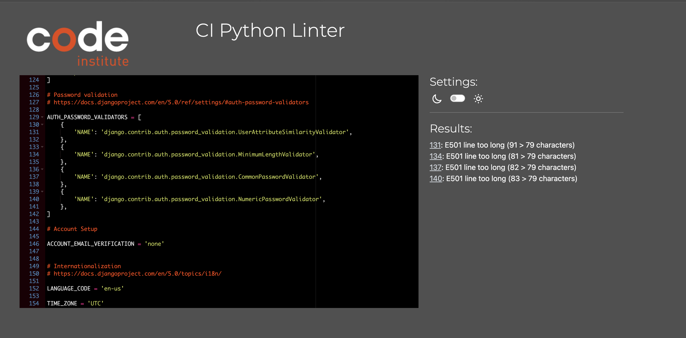

# Documented Manual Testing for | BrickBros

This project was tested throughout the duration of the project creation. This was done with ensuring the user story / feature was designed and working as intended when being coded.
The project was also tested frequently via Google Chrome Dev Tools for display issues. 

## Validation Testing

### HTML Checks

All Html files were tested using [W3C Schools validator](https://validator.w3.org/) in logged in and logged out state.

All issues were resolved and files now pass checks.

### CSS Checks

CCS Files were tested using [W3C Schools CCS Validator](https://jigsaw.w3.org/css-validator/)

File passed checks first time.

### Python Checks

Python files were checked using the [CI PEP8 Linter](https://pep8ci.herokuapp.com/)

Issues were resolved and files now pass checks.

#### Outstanding.
I had a few lines too long in the settings.py as shown below:

## User Stories

 Outer pipes  Cell padding 
No sorting
| User Story                                                                   | Test                                                                                                                            | Action                                                                                                                                                                              | Expected                                                                                                                          | Result (Pass/Fail) |
| ---------------------------------------------------------------------------- | ------------------------------------------------------------------------------------------------------------------------------- | ----------------------------------------------------------------------------------------------------------------------------------------------------------------------------------- | --------------------------------------------------------------------------------------------------------------------------------- | ------------------ |
| [User Story #2](https://github.com/philtipping31/PP4---BrickBros/issues/2)   | The site works as intended throughout in a deployed environment                                                                 | Perform all tests as documented below on the deployed site via Heroku                                                                                                               | All features, views, options work as intended                                                                                     | Pass               |
| [User Story #3](https://github.com/philtipping31/PP4---BrickBros/issues/3)   | Check nav bar and footer are on all pages from base.html                                                                        | View each page in deployed environement and clearly see the navbar and footer                                                                                                       | Features appear on all pages as stem from the base.html file                                                                      | Pass               |
| [User Story #6](https://github.com/philtipping31/PP4---BrickBros/issues/6)   | When logged in and logged out, click 'view more' on a build post to see more content about a specific post                      | Click 'Read More' on a build post when logged in and logged out of a profile                                                                                                        | An individual build post opens up and displays as intended                                                                        | Pass               |
| [User Story #11](https://github.com/philtipping31/PP4---BrickBros/issues/11) | Register button clearly shown in nav bar for users not logged in to an account                                                  | View all pages and check for Register link if not logged in                                                                                                                         | Register field appears in on all pages when user not logged in                                                                    | Pass               |
| [User Story #11](https://github.com/philtipping31/PP4---BrickBros/issues/11) | When register is clicked on, the register page is loaded correctly                                                              | View site on all pages and navigate to the Register (SignUp) page                                                                                                                   | Sign up page correctly loads and is visbile on all screensizes                                                                    | Pass               |
| [User Story #11](https://github.com/philtipping31/PP4---BrickBros/issues/11) | Fields work as intended, username is required, email address is not required, password needs to match criteria                  | Attempt to sign up without required fields - check prompt to complete shows. Try password variation that does not meet criteria and check prompt                                    | Prompts show as intended if criteria does not match. If all fields match then signup successful and logs user in to their account | Pass               |
| [User Story #12](https://github.com/philtipping31/PP4---BrickBros/issues/12) | User can not add a build when not logged in                                                                                     | Navigate to 'Add Build' when not logged in                                                                                                                                          | Check sign in page loads asking user to sign in to fully engage with the site                                                     | Pass               |
| [User Story #12](https://github.com/philtipping31/PP4---BrickBros/issues/12) | Once logged in 'Add Build' page is now accessible.                                                                              | Navigate to 'Add Build' when logged in to view the front end form to add a post.                                                                                                    | As the user is logged in the page displays as it should with all fields ready for the user to enter                               | Pass               |
| [User Story #12](https://github.com/philtipping31/PP4---BrickBros/issues/12) | Adding a post successfully                                                                                                      | Attempt to fill in the post form, missing items prompts user to fill in if required. If not image added, default placeholder is added, when post is added, user is notified of this | All features work as intended                                                                                                     | Pass               |
| [User Story #14](https://github.com/philtipping31/PP4---BrickBros/issues/14) | Appending /admin to the URL opens up Django Admin panel                                                                         | Add /admin to the URL to ensure admin access is available for the super user                                                                                                        | Admin page is accessed correctly for the super user. If non super user logged in and appends /admin, access denied                | Pass               |
| [User Story #16](https://github.com/philtipping31/PP4---BrickBros/issues/16) | If a user is logged in, they can view their own post and see the edit button                                                    | Log in as a user and view a post that the user has created to see the edit button                                                                                                   | Edit button displays for an owner of a post                                                                                       | Pass               |
| [User Story #16](https://github.com/philtipping31/PP4---BrickBros/issues/16) | If a user isn't logged in or doesn't own a post, edit will not be an option                                                     | View a post by a different user to the logged in user                                                                                                                               | Edit button is not visible                                                                                                        | Pass               |
| [User Story #16](https://github.com/philtipping31/PP4---BrickBros/issues/16) | If a user edits a post, they can see all previous fields to amend                                                               | Click edit and view the post form again with all fields in place                                                                                                                    | As expected, all items are populated and able to be edited                                                                        | Pass               |
| [User Story #16](https://github.com/philtipping31/PP4---BrickBros/issues/16) | If a user edits a post and submits the edit, they are notified of the confirmation of edit                                      | Edit a post and submit the edit - pop up confirms post edited                                                                                                                       | Edit is successful and pop up shown confirming edit                                                                               | Pass               |
| [User Story #17](https://github.com/philtipping31/PP4---BrickBros/issues/17) | If a user is logged in, they can view their own post and see the delete button                                                  | Log in as a user and view a post that the user has created to see the delete button                                                                                                 | Delete button displays for an owner of a post                                                                                     | Pass               |
| [User Story #17](https://github.com/philtipping31/PP4---BrickBros/issues/17) | If a user isn't logged in or doesn't own a post, delete will not be an option                                                   | View a post by a different user to the logged in user                                                                                                                               | Delete button is not visible                                                                                                      | Pass               |
| [User Story #17](https://github.com/philtipping31/PP4---BrickBros/issues/17) | If a user delete a post, they will be prompted to confirm the deletion of a post                                                | Click on the delete post option                                                                                                                                                     | Clicking delete, opens up the confirm delete page and allows the user to confirm deletion                                         | Pass               |
| [User Story #17](https://github.com/philtipping31/PP4---BrickBros/issues/17) | If a user deletes a post and submits the deletion, they are notified of the confirmation of edit                                | Confirm the deletion of a post                                                                                                                                                      | User is directed back to all builds, pop up shows that post was successfully deleted                                              | Pass               |
| [User Story #18](https://github.com/philtipping31/PP4---BrickBros/issues/18) | Once user has registered for account they can login                                                                             | Create a user and login                                                                                                                                                             | Login successful                                                                                                                  | Pass               |
| [User Story #19](https://github.com/philtipping31/PP4---BrickBros/issues/19) | Search bar shows on the 'All Builds' page                                                                                       | Go to all builds and search bar is available                                                                                                                                        | Search bar displays on all builds page                                                                                            | Pass               |
| [User Story #19](https://github.com/philtipping31/PP4---BrickBros/issues/19) | Search bar placeholder text shows just model numbers accepted                                                                   | Search bar clearly tells user to search for model numbers                                                                                                                           | Model number search feature works                                                                                                 | Pass               |
| [User Story #19](https://github.com/philtipping31/PP4---BrickBros/issues/19) | When a search is made, results show if match found                                                                              | Type in a model number that exists in the database                                                                                                                                  | Search clearly displays the correct results                                                                                       | Pass               |
| [User Story #19](https://github.com/philtipping31/PP4---BrickBros/issues/19) | When a search is made and no matches found, user is notified of this                                                            | Enter a model number that does not exist                                                                                                                                            | Page shows no matches found and prompts user to add the first post                                                                | Pass               |
| [User Story #20](https://github.com/philtipping31/PP4---BrickBros/issues/20) | If a user is logged in they can see the option to logout in the navbar                                                          | Once logged in, checked that the logout button/link is available                                                                                                                    | Once logged in, the logout button/link is available                                                                               | Pass               |
| [User Story #20](https://github.com/philtipping31/PP4---BrickBros/issues/20) | If user clicks logout, they will be asked if they meant to do this. Also option to go to the home page for UX will be an option | Click logout and check that the user is asked to confirm the action                                                                                                                 | Logout button takes you to the correct page asking to confirm whether or not you want to login or go back to the home page        | Pass               |
| [User Story #20](https://github.com/philtipping31/PP4---BrickBros/issues/20) | If user confirms logout, user will be logged out and notified                                                                   | Click confirm log out                                                                                                                                                               | User is notified that they have been logged out.                                                                                  | Pass               |

## Manual Testing

